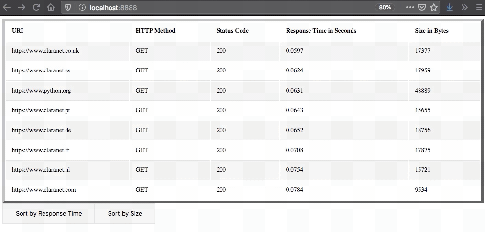

## :rocket: Fetch Request/Response data from URLs

#### Description:
- Asynchronous small and lightweight web application that requests and displays the response data using bottle/templates.

#### Application View and Teminal View:

#### How do I run it?
- You will need python version 3.7 or higher.
- Clone the repo:
`git clone git@github.com:LuisJLopez/get-response-data.git`
- Then install the required packages by running:
`pip install -r requirements.txt`
- Once the packages have been installed, run:
`python project` to start bottle.

#### Live Demo (Heroku):
- https://apricot-custard-62849.herokuapp.com/

#### Github Pages:
- https://luisjlopez.github.io/fetch-websites-responses/
