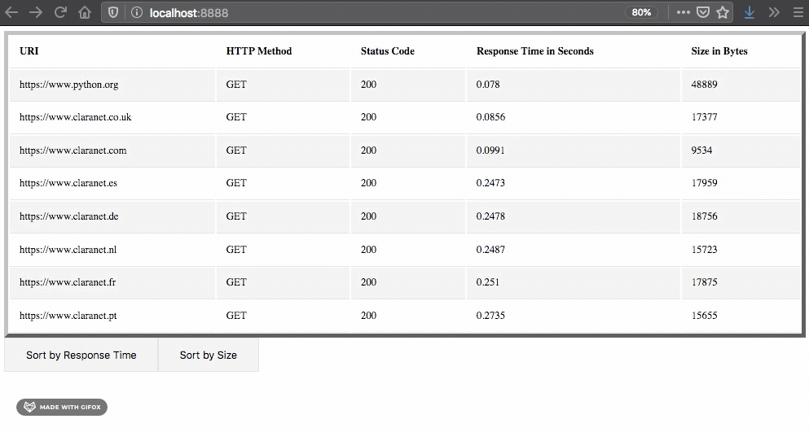

## :rocket: Fetch Request/Response data from URLs

#### Description:
- Asynchronous small and lightweight web application that requests and displays the response data using bottle/templates.

#### App view & Teminal view:

#### How to run it:
- You will need a python version equal or higher to 3.7
- Clone the repo:
`git clone git@github.com:LuisJLopez/get-response-data.git`
- Then install the required packages by running:
`pip install -r requirements.txt`
- Once packages have been install run:
`python project` to start bottle.

